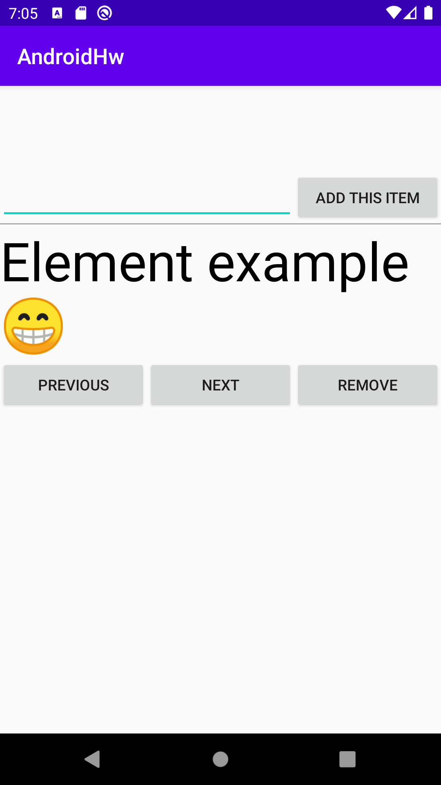

# Android Hello World Example
This is a simple example of a Android Application, which is written in **Kotlin** and uses dependency
injection via **Dagger 2**. The architecture of the project is inspired by the **Clean architecture**
approach and the **MVVM** GUI design pattern.  
  
Abilities of the applications are quite simple: it can only add and remove short messages.
The messages are stored in internal text file.  
  
Can be compiled and run using a recent version of **Android Studio**.  

  
Barashkov A.A, 2020